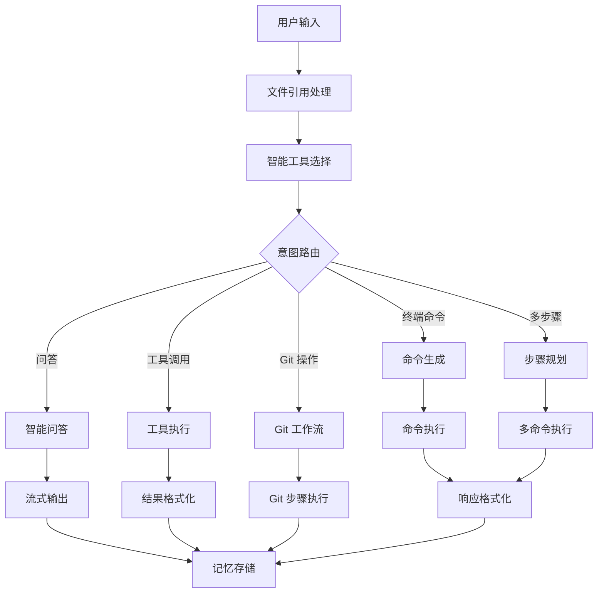
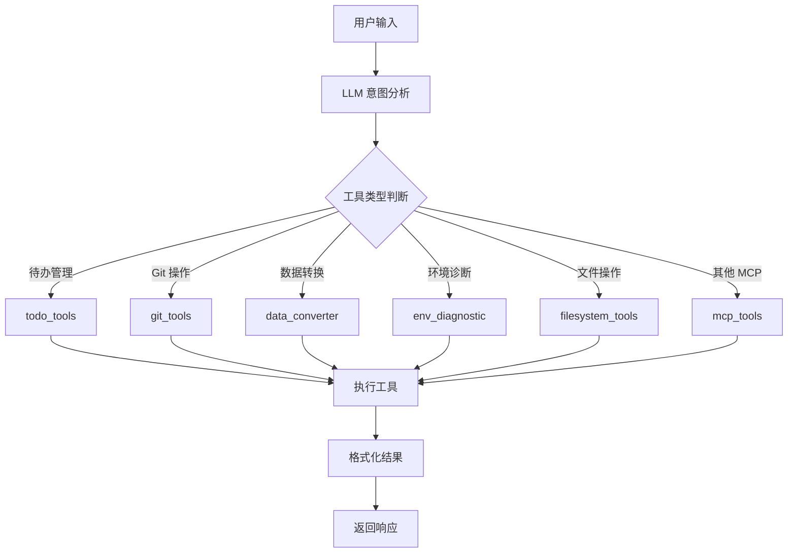

# 🤖 DNM 智能体功能架构文档

> 本文档详细描述 DNM 智能体终端控制工具的所有功能模块、实现流程和技术架构，为后续开发者提供全面的理解指南。

## 📋 目录

- [项目概览](#项目概览)
- [核心架构](#核心架构)
- [功能模块详解](#功能模块详解)
- [工作流程](#工作流程)
- [技术实现](#技术实现)
- [开发指南](#开发指南)

---

## 🎯 项目概览

### 项目简介
DNM 是一个基于 LangGraph 和 LangChain 的智能终端助手，支持自然语言执行命令、文件操作、代码生成和智能问答。项目采用双 LLM 架构，通过 MCP (Model Context Protocol) 集成实现强大的工具调用能力。

### 核心特性
- 🗣️ **自然语言执行命令** - 用人话说，让 AI 执行终端命令
- 📁 **@ 智能文件引用** - 交互式文件选择器，IDE 风格自动补全
- 🧠 **对话记忆** - 记住上下文，支持连续对话
- 📝 **Git 智能工具** - 自动生成 commit 消息、完整工作流
- 📊 **数据转换工具** - JSON/CSV/YAML/XML 格式互转、验证
- 🔍 **环境诊断** - 自动检测开发环境配置和依赖问题
- 📋 **待办事项管理** - 智能识别并管理日程安排和任务提醒
- 🔌 **MCP 集成** - 文件系统和桌面控制功能
- 🎯 **双 LLM 架构** - 通用模型处理对话，代码模型生成命令

### 入口文件
主入口文件是 `dnm`，这是一个可执行的 Python 脚本，提供 CLI 接口。

---

## 🏗️ 核心架构

### 架构层次

```
┌─────────────────────────────────────────────────────────────┐
│                        CLI 入口层                           │
│                      dnm (主程序)                           │
└─────────────────────────┬───────────────────────────────────┘
                          │
┌─────────────────────────┴───────────────────────────────────┐
│                      用户界面层                             │
│  • agent_ui.py - 用户交互和特殊命令                        │
│  • input_handlers.py - 智能输入处理                        │
│  • smart_file_input.py - IDE 风格文件输入                  │
│  • interactive_file_selector.py - 交互式文件选择器         │
│  • file_reference_parser.py - @ 文件引用解析               │
└─────────────────────────┬───────────────────────────────────┘
                          │
┌─────────────────────────┴───────────────────────────────────┐
│                      工作流层                               │
│  • agent_workflow.py - LangGraph 工作流定义和路由          │
│  • agent_nodes.py - 所有工作流节点实现                     │
└─────────────────────────┬───────────────────────────────────┘
                          │
┌─────────────────────────┴───────────────────────────────────┐
│                      工具层                                 │
│  • mcp_manager.py - MCP 工具管理和调用                     │
│  • agent_tool_calling.py - 智能工具选择和调用              │
│  • todo_manager.py - 待办事项管理                          │
│  • git_tools.py - Git 操作工具                             │
│  • data_converter_tools.py - 数据转换工具                  │
│  • env_diagnostic_tools.py - 环境诊断工具                  │
└─────────────────────────┬───────────────────────────────────┘
                          │
┌─────────────────────────┴───────────────────────────────────┐
│                      支持层                                 │
│  • agent_config.py - 双 LLM 配置、工作目录、安全配置       │
│  • agent_memory.py - 对话历史管理                          │
│  • agent_llm.py - LLM 实例化和管理                         │
│  • agent_utils.py - 工具函数                               │
│  • agent_types.py - 类型定义和数据结构                     │
└─────────────────────────────────────────────────────────────┘
```

### 双 LLM 架构

项目采用双 LLM 架构，针对不同任务使用不同的模型：

- **通用模型** (`LLM_CONFIG`): Kimi-K2 - 用于意图分析、智能问答、上下文理解
- **代码模型** (`LLM_CONFIG2`): Claude-3.5-Sonnet - 用于命令生成、代码编写、任务规划

### 数据流架构

```
用户输入 → 文件引用解析 → 智能工具选择 → 工作流路由
                                    ↓
                     ┌──────────────┼──────────────┐
                     ↓              ↓              ↓
                 命令执行        文件操作        智能问答
                     ↓              ↓              ↓
                     └──────────────┼──────────────┘
                                    ↓
                            结果生成 → 记忆存储
```

---

## 🔧 功能模块详解

### 1. 智能文件引用系统

#### 核心文件
- `src/ui/file_reference_parser.py` - @ 语法解析器
- `src/ui/interactive_file_selector.py` - 交互式文件选择器
- `src/ui/smart_file_input.py` - IDE 风格智能输入

#### 实现原理
1. **@ 语法解析**: 使用正则表达式识别 `@filename` 模式
2. **智能匹配**: 支持模糊搜索、通配符、相对/绝对路径
3. **交互式选择**: 提供分页浏览、实时搜索、数字快选
4. **IDE 风格补全**: 实时自动补全，上下箭头导航，Tab 键补全

#### 支持的语法
```bash
@filename.ext        # 智能匹配文件名
@./path/file.ext     # 相对路径
@/absolute/path      # 绝对路径
@*.py                # 通配符匹配
@folder/             # 目录引用
```

#### 工作流程
```
用户输入 @ → 解析文件引用 → 智能匹配 → 读取文件内容 → 添加到上下文
```

### 2. MCP 集成系统

#### 核心文件
- `src/mcp/mcp_manager.py` - MCP 服务器管理器
- `src/mcp/agent_tool_calling.py` - 智能工具调用
- `src/mcp/mcp_filesystem.py` - 文件系统工具
- `mcp_config.json` - MCP 配置文件

#### 实现原理
1. **统一工具注册表**: 将所有工具（内置、MCP、LangChain）统一管理
2. **零分支自动分发**: 通过工具类型自动路由到对应的执行器
3. **缓存优化**: 工具列表缓存，后台异步刷新
4. **智能工具选择**: LLM 自主分析意图并选择合适的工具

#### 工具类型
- **内置工具**: 文件系统操作（读取、写入、列表等）
- **MCP 工具**: 外部 MCP 服务器提供的工具
- **LangChain 工具**: 待办管理、Git 操作、数据转换等

#### 调用流程
```
用户请求 → LLM 分析意图 → 选择工具 → 统一调用接口 → 执行工具 → 返回结果
```

### 3. Git 智能工具系统

#### 核心文件
- `src/tools/git_tools.py` - Git 基础操作
- `src/tools/git_commit_tools.py` - 智能 commit 消息生成
- `src/tools/auto_commit_tools.py` - 自动提交工作流
- `src/tools/code_review_tools.py` - 代码审查工具

#### 功能特性
1. **智能 Commit 消息**: 基于 git diff 分析生成语义化提交消息
2. **完整工作流**: 支持 3 步骤提交和 5 步骤完整流程
3. **自动分支识别**: 智能识别 dev/main/feature 分支
4. **代码审查**: AI 驱动的代码质量分析

#### 工作流类型
- **auto_commit**: `git add` → 生成消息 → `git commit`
- **full_git_workflow**: `git pull` → `git add` → 生成消息 → `git commit` → `git push`
- **单独操作**: 支持独立的 pull/push 操作

### 4. 待办事项管理系统

#### 核心文件
- `src/tools/todo_manager.py` - 待办事项管理器
- `src/tools/todo_tools.py` - LangChain 工具封装

#### 实现特性
1. **按日期存储**: 每日独立的 JSON 文件存储
2. **智能解析**: 自然语言识别时间和内容
3. **状态管理**: 支持待办状态跟踪
4. **搜索功能**: 支持内容搜索和日期范围查询

#### 数据结构
```json
{
  "date": "2025-10-24",
  "todos": [
    {
      "id": "uuid",
      "time": "18:00",
      "content": "给陈龙打电话",
      "status": "pending",
      "created_at": "2025-10-24 10:30:00"
    }
  ]
}
```

### 5. 数据转换工具系统

#### 核心文件
- `src/tools/data_converter_tools.py` - 数据格式转换工具

#### 支持格式
- JSON ↔ CSV
- JSON ↔ YAML
- JSON ↔ XML
- CSV ↔ YAML
- 格式验证和美化

#### 转换流程
```
检测输入格式 → 解析数据 → 转换格式 → 验证输出 → 返回结果
```

### 6. 环境诊断系统

#### 核心文件
- `src/tools/env_diagnostic_tools.py` - 环境诊断工具

#### 诊断项目
1. **Python 环境**: 版本、虚拟环境、包管理器
2. **开发工具**: Git、Node.js、Docker 等
3. **依赖检查**: requirements.txt、package.json 等
4. **配置文件**: 环境变量、配置文件完整性

### 7. 对话记忆系统

#### 核心文件
- `src/core/agent_memory.py` - 对话历史管理

#### 实现特性
1. **上下文保持**: 记住对话历史和命令执行结果
2. **智能摘要**: 长对话自动摘要，避免上下文溢出
3. **意图关联**: 根据意图类型优化记忆存储
4. **持久化存储**: 支持会话间的记忆保持

---

## 🔄 工作流程

### 主工作流程



### Git 工作流详解

#### 自动提交工作流 (auto_commit)
```
1. git add . (暂存所有变更)
2. 分析 git diff 生成 commit 消息
3. git commit -m "消息"
```

#### 完整 Git 工作流 (full_git_workflow)
```
1. git pull (拉取最新代码)
2. git add . (暂存所有变更)
3. 分析 git diff 生成 commit 消息
4. git commit -m "消息"
5. git push (推送到远程)
```

### 工具选择流程



---

## 💻 技术实现

### 核心技术栈

- **框架**: LangGraph + LangChain
- **LLM**: Kimi-K2 (通用) + Claude-3.5-Sonnet (代码)
- **协议**: MCP (Model Context Protocol)
- **语言**: Python 3.8+
- **UI**: prompt_toolkit (交互式界面)

### 关键设计模式

#### 1. 状态机模式 (LangGraph)
使用 LangGraph 的状态图模式管理复杂的工作流程，每个节点负责特定的处理逻辑。

#### 2. 工具注册表模式
统一的工具注册表管理所有工具，支持动态注册和零分支调用。

#### 3. 双 LLM 策略模式
根据任务类型选择合适的 LLM，优化性能和成本。

#### 4. 插件化架构
通过 MCP 协议支持外部工具集成，实现功能的可扩展性。

### 数据结构设计

#### AgentState (工作流状态)
```python
@dataclass
class AgentState:
    user_input: str                    # 用户输入
    intent: str                        # 意图类型
    response: str                      # 响应内容
    file_contents: Dict[str, str]      # 文件内容
    referenced_files: List[Dict]       # 引用的文件
    commands: List[str]                # 生成的命令
    execution_results: List[Dict]      # 执行结果
    mcp_context: Optional[MCPContext]  # MCP 上下文
    todo_data: Optional[TodoData]      # 待办数据
    git_data: Optional[GitData]        # Git 数据
    error: Optional[str]               # 错误信息
```

#### 文件引用结构
```python
@dataclass
class FileReference:
    original_text: str        # 原始文本
    file_path: str           # 文件路径
    exists: bool             # 是否存在
    is_directory: bool       # 是否为目录
    match_confidence: float  # 匹配置信度
```

---

## 🛠️ 开发指南

### 项目结构

```
dnm/                              # 项目根目录
├── dnm                           # 主入口文件 (可执行)
├── src/                          # 源代码目录
│   ├── core/                     # 核心模块
│   │   ├── agent_config.py       # 配置管理
│   │   ├── agent_workflow.py     # 工作流定义
│   │   ├── agent_nodes.py        # 节点实现
│   │   ├── agent_memory.py       # 记忆管理
│   │   ├── agent_llm.py          # LLM 管理
│   │   ├── agent_utils.py        # 工具函数
│   │   └── agent_types.py        # 类型定义
│   ├── ui/                       # 用户界面
│   │   ├── agent_ui.py           # 主界面
│   │   ├── input_handlers.py     # 输入处理
│   │   ├── smart_file_input.py   # 智能文件输入
│   │   ├── interactive_file_selector.py  # 文件选择器
│   │   └── file_reference_parser.py      # 文件引用解析
│   ├── mcp/                      # MCP 集成
│   │   ├── mcp_manager.py        # MCP 管理器
│   │   ├── agent_tool_calling.py # 工具调用
│   │   └── mcp_filesystem.py     # 文件系统工具
│   └── tools/                    # 工具模块
│       ├── todo_manager.py       # 待办管理
│       ├── todo_tools.py         # 待办工具
│       ├── git_tools.py          # Git 工具
│       ├── git_commit_tools.py   # Git 提交工具
│       ├── auto_commit_tools.py  # 自动提交
│       ├── code_review_tools.py  # 代码审查
│       ├── data_converter_tools.py  # 数据转换
│       └── env_diagnostic_tools.py  # 环境诊断
├── docs/                         # 文档目录
├── test/                         # 测试文件
├── mcp_config.json              # MCP 配置
├── requirements.txt             # Python 依赖
└── README.md                    # 项目说明
```

### 添加新功能

#### 1. 添加新工具
```python
# 1. 在 src/tools/ 下创建工具文件
# 2. 实现工具函数
def my_tool_func(input_str: str) -> str:
    """工具功能实现"""
    pass

# 3. 创建 LangChain Tool
my_tool = Tool(
    name="my_tool",
    description="工具描述",
    func=my_tool_func
)

# 4. 在 mcp_manager.py 中注册工具
def _register_langchain_tools(self):
    self.tool_registry["my_tool"] = {
        "name": "my_tool",
        "description": "工具描述",
        "type": "builtin",
        "func": my_tool_func,
        "parameters": {...}
    }
```

#### 2. 添加新节点
```python
# 1. 在 agent_nodes.py 中添加节点函数
def my_new_node(state: AgentState) -> dict:
    """新节点实现"""
    # 处理逻辑
    return {"response": "处理结果"}

# 2. 在 agent_workflow.py 中注册节点
workflow.add_node("my_new_node", my_new_node)

# 3. 添加路由逻辑
def route_to_new_node(state: AgentState) -> str:
    if state["intent"] == "my_intent":
        return "my_new_node"
    return "default_node"
```

#### 3. 扩展意图识别
```python
# 在 agent_tool_calling.py 的 simple_tool_calling_node 中
# 添加新的意图判断逻辑
if "关键词" in user_input.lower():
    return {
        "intent": "new_intent",
        "response": "处理结果"
    }
```

### 配置管理

#### LLM 配置
```python
# src/core/agent_config.py
LLM_CONFIG = {
    "model": "kimi-k2-0905-preview",
    "base_url": "https://api.moonshot.cn/v1",
    "api_key": "your-api-key",
    "temperature": 0,
}

LLM_CONFIG2 = {
    "model": "claude-3-5-sonnet",
    "base_url": "https://your-proxy/v1",
    "api_key": "your-api-key",
    "temperature": 0,
}
```

#### MCP 配置
```json
{
  "servers": {
    "filesystem": {
      "command": "npx",
      "args": ["-y", "@modelcontextprotocol/server-filesystem", "/path/to/workspace"],
      "description": "文件系统操作工具"
    }
  }
}
```

### 测试和调试

#### 运行测试
```bash
# 功能测试
python test/test_new_features.py

# 集成测试
python test/test_integration.py

# 工作流测试
python test/agent_workflow_v2.py
```

#### 调试技巧
1. **启用详细日志**: 在节点中添加 `print` 语句跟踪执行流程
2. **状态检查**: 在关键节点检查 `state` 的内容
3. **工具测试**: 单独测试工具函数的输入输出
4. **MCP 调试**: 检查 MCP 服务器的连接和响应

### 性能优化

#### 1. 缓存策略
- MCP 工具列表缓存 (24小时)
- 文件内容缓存 (会话级别)
- LLM 响应缓存 (相同输入)

#### 2. 异步处理
- MCP 工具发现异步执行
- 文件读取并发处理
- 长时间命令后台执行

#### 3. 内存管理
- 对话历史自动清理
- 大文件分块处理
- 状态对象及时释放

---

## 📚 相关文档

- [README.md](README.md) - 项目主文档和快速开始
- [docs/INSTALLATION_GUIDE.md](docs/INSTALLATION_GUIDE.md) - 详细安装指南
- [docs/QUICK_START.md](docs/QUICK_START.md) - 快速开始教程
- [docs/MCP_INTEGRATION_SUMMARY.md](docs/MCP_INTEGRATION_SUMMARY.md) - MCP 集成详解
- [docs/GIT_FULL_WORKFLOW_SUMMARY.md](docs/GIT_FULL_WORKFLOW_SUMMARY.md) - Git 工作流详解
- [docs/FILE_REFERENCE_UPGRADE_SUMMARY.md](docs/FILE_REFERENCE_UPGRADE_SUMMARY.md) - 文件引用功能详解

---

## 🤝 贡献指南

### 开发流程
1. Fork 项目
2. 创建功能分支: `git checkout -b feature/new-feature`
3. 提交更改: `git commit -m "Add new feature"`
4. 推送分支: `git push origin feature/new-feature`
5. 创建 Pull Request

### 代码规范
- 遵循 PEP 8 代码风格
- 使用类型注解
- 添加详细的文档字符串
- 保持函数简洁，单一职责
- 使用有意义的变量和函数名

### 提交规范
- `feat:` 新功能
- `fix:` 错误修复
- `docs:` 文档更新
- `style:` 代码格式调整
- `refactor:` 代码重构
- `test:` 测试相关
- `chore:` 构建过程或辅助工具的变动

---

## 📄 许可证

本项目采用 MIT 许可证，详见 [LICENSE](LICENSE) 文件。

---

*本文档持续更新中，如有问题或建议，欢迎提交 Issue 或 Pull Request。*
